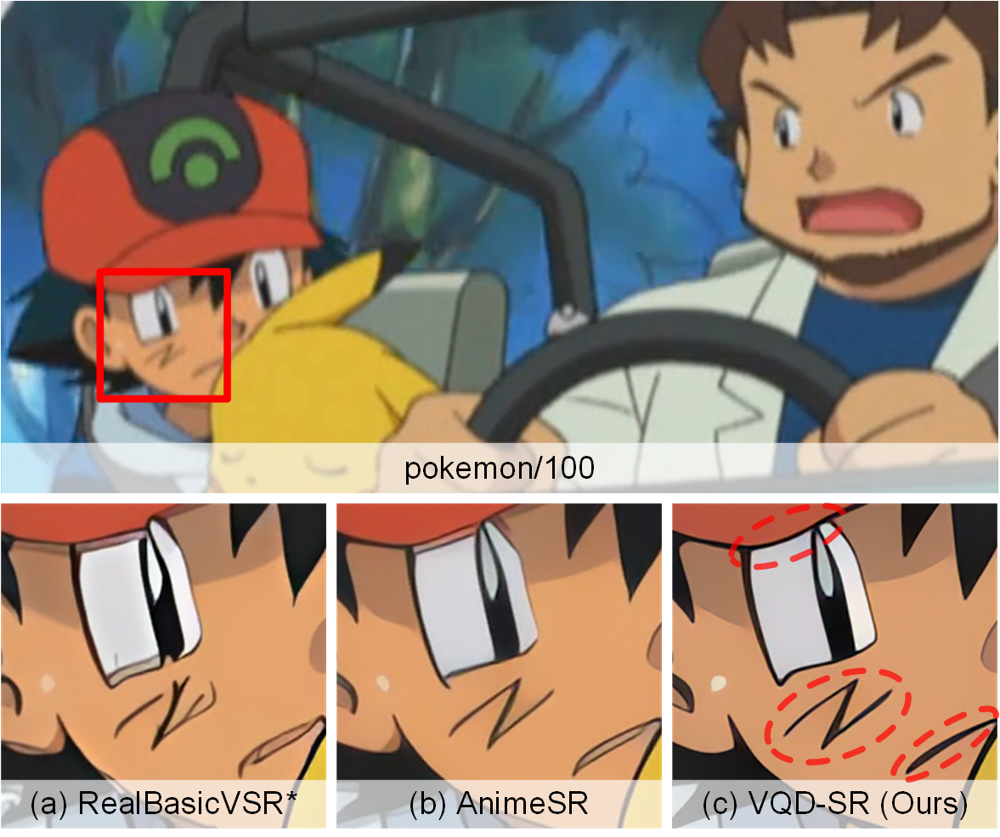
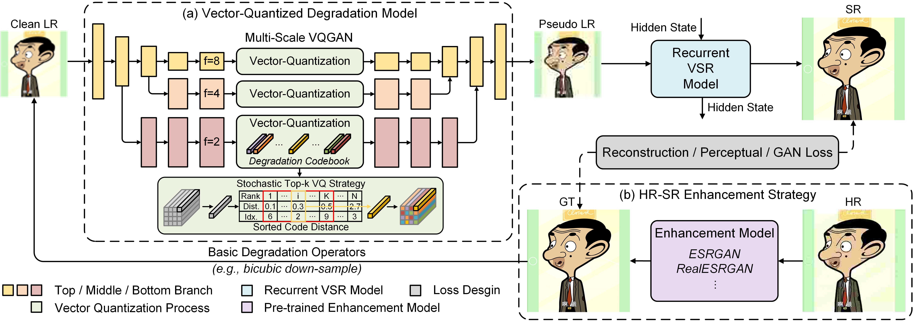

# VQD-SR (ICCV 2023)

### Learning Data-Driven Vector-Quantized Degradation Model for Animation Video Super-Resolution
> [](https://arxiv.org/abs/2303.09826)<br>

## Contents
- [Introduction](#introduction)
  - [Overview](#overview)
  - [Visual](#visual)
- [Dependencies and Installation](#dependencies-and-installation)
- [Quick Inference](#quick-inference)
- [Training](#training)
- [Request for RAL Dataset](request-for-ral-dataset)
- [Related Projects](#related-projects)
- [Citation](#citation)
- [Acknowledgement](#acknowledgement)
- [Contact](#contact)

## Introduction
We propose a real-world animation video super-resolution method VQD-SR, which utilizes a multi-scale VQGAN to decompose the local details from global structures and transfer the degradation priors from real-world animation videos to the learned vector-quantized codebook for degradation modeling. A data enhancement strategy for high-resolution (HR) training videos called HR-SR enhancement is also proposed to further improve the performance of existing VSR methods for animation. 



### Overview


### Visual


## Dependencies and Installation
- Python == 3.8 (Recommend to use [Anaconda](https://www.anaconda.com/download/#linux) or [Miniconda](https://docs.conda.io/en/latest/miniconda.html))
- [PyTorch == 1.10.1](https://pytorch.org/)
- Other required packages in `requirements.txt`

### Installation

1. Clone repo

    ```bash
    git clone https://github.com/zizixixi/VQD-SR.git
    cd VQD-SR
    ```
2. Install

    ```bash
    pip install -r requirements.txt
    python setup.py develop
    ```

## Quick Inference
Download the pre-trained VQD-SR models [[Google Drive](https://drive.google.com/file/d/1MvDG9NfZjnW0kyCyPtokgC3M8lhFgnLv/view?usp=drive_link)], and put them into the [weights](weights/) folder. Currently, the available pre-trained models are:
- `vqdsr_gan.pth`: The VSR model trained with VQ degradation and HR-SR enhancement. You can use this model for paper results reproducing.
- `pretrain_mul_vqgan.ckpt`: The multi-scale VQ degradation model.
- `vqdsr_net_d.pth`: The trained discriminator when getting `vqdsr_gan.pth`.
- `vqdsr_net.pth`: The pre-trained VSR net model.
- `pretrain_top.ckpt`: The pre-trained top scale VQ degradation model.

VQD-SR supports both frames and videos as input for inference. 

**Inference on Frames**
```bash
python scripts/inference_vqdsr_frame.py -i ./input --model_path weights/vqdsr_gan.pth --expname vqdsr_gan ---save_video_too
```
```console
Usage:
  -i --input           Input frames folder/root. Support first level dir (i.e., input/*.png) and second level dir (i.e., input/*/*.png)
  --model_path         The pre-trained or customly trained model path
  -s --outscale        The netscale is x4, but you can achieve arbitrary output scale (e.g., x2 or x1) with the argument outscale.
                       The program will further perform cheap resize operation after the SR output. Default: 4
  -o --output          Output root. Default: results
  -expname             Identify the name of your current inference. The outputs will be saved in $output/$expname
  -save_video_too      Save the output frames to video. Default: off
  --ema                Whether to use ema model for inference when ema model available. Default: on
  -fps                 The fps of the (possible) saved videos. Default: 24
```
After run the above command, you will get the SR frames in `results/vqdsr_gan/frames` and the SR video in `results/vqdsr_gan/videos`.

**Inference on Video**
```bash
# single gpu and single process inference
CUDA_VISIBLE_DEVICES=0 python scripts/inference_vqdsr_video.py -i inputs/lr_anime.mp4 weights/VQDSR_gan.pth --expname vqdsr_gan num_process_per_gpu 1 --suffix 1gpu1process
# single gpu and multi process inference (you can use multi-processing to improve GPU utilization)
CUDA_VISIBLE_DEVICES=0 python scripts/inference_vqdsr_video.py -i inputs/lr_anime.mp4 weights/VQDSR_gan.pth --expname vqdsr_gan num_process_per_gpu 2 --suffix 1gpu2process
# multi gpu and multi process inference
CUDA_VISIBLE_DEVICES=0,1 python scripts/inference_vqdsr_video.py -i inputs/lr_anime.mp4 weights/VQDSR_gan.pth --expname vqdsr_gan num_process_per_gpu 2 --suffix 2gpu4process
```
```console
Usage:
  -i --input           Input video path or extracted frames folder
  --model_path         The pre-trained or customly trained model path
  -s --outscale        The netscale is x4, but you can achieve arbitrary output scale (e.g., x2 or x1) with the argument outscale.
                       The program will further perform cheap resize operation after the SR output. Default: 4
  -o -output           Output root. Default: results
  -expname             Identify the name of your current inference. The outputs will be saved in $output/$expname
  -fps                 The fps of the (possible) saved videos. Default: None
  -extract_frame_first If input is a video, you can still extract the frames first, other wise it will read from stream
  -num_process_per_gpu Since the slow I/O speed will make GPU utilization not high enough, so as long as the
                       video memory is sufficient, we recommend placing multiple processes on one GPU to increase the utilization of each GPU.
                       The total process will be number_process_per_gpu * num_gpu
  -suffix              You can add a suffix string to the sr video name, for example, 1gpu3processx2 which means the SR video is generated with one GPU and three process and the outscale is x2
  -half                Use half precision for inference, it won't make big impact on the visual results
```
SR videos are saved in `results/vqdsr_gan/videos/$video_name` folder.


## Training
See [Training.md](Training.md)

## Request for RAL Dataset
1. Download and carefully read the [RAL LICENSE AGREEMENT](RAL%20LICENSE%20AGREEMENT.pdf) PDF file.
2. If you understand, acknowledge, and agree to all the terms specified in the [LICENSE AGREEMENT](RAL%20LICENSE%20AGREEMENT.pdf). Please email `zixit99@gmail.com` with the **RAL LICENSE AGREEMENT PDF** file. We will keep the license and send the download link of RAL dataset to you.


## Related Projects
We also sincerely recommend some other excellent works related to us. :sparkles: 
* [FTVSR: Learning Spatiotemporal Frequency-Transformer for Compressed Video Super-Resolution](https://github.com/researchmm/FTVSR)
* [TTVSR: Learning Trajectory-Aware Transformer for Video Super-Resolution](https://github.com/researchmm/TTVSR/tree/main)
* [TTSR: Learning Texture Transformer Network for Image Super-Resolution](https://github.com/researchmm/TTSR)
* [CKDN: Learning Conditional Knowledge Distillation for Degraded-Reference Image Quality Assessment](https://github.com/researchmm/CKDN)

##  Citation
If you find this project useful for your research, please consider citing our paper. :smiley:
```bibtex
@article{tuo2023learning,
  title={Learning Data-Driven Vector-Quantized Degradation Model for Animation Video Super-Resolution},
  author={Tuo, Zixi and Yang, Huan and Fu, Jianlong and Dun, Yujie and Qian, Xueming},
  journal={arXiv preprint arXiv:2303.09826},
  year={2023}
}
```
## Acknowledgement
This project is build based on [BasicSR](https://github.com/XPixelGroup/BasicSR), [AnimeSR](https://github.com/TencentARC/AnimeSR) and [taming-transformers](https://github.com/CompVis/taming-transformers). We thank the authors for sharing their code.

## Contact
:e-mail: If you have any questions, please email `zixit99@gmail.com`. 

